# Finance Tracker

A private budgeting and spending tracker that runs entirely in your browser. You bring the CSV exports from your
banks and credit cards; it turns them into budgets, charts, forecasts and goals. Your data never leaves your computer.

**Open it: https://jordan-bring-gold.github.io/FinanceTracker/**

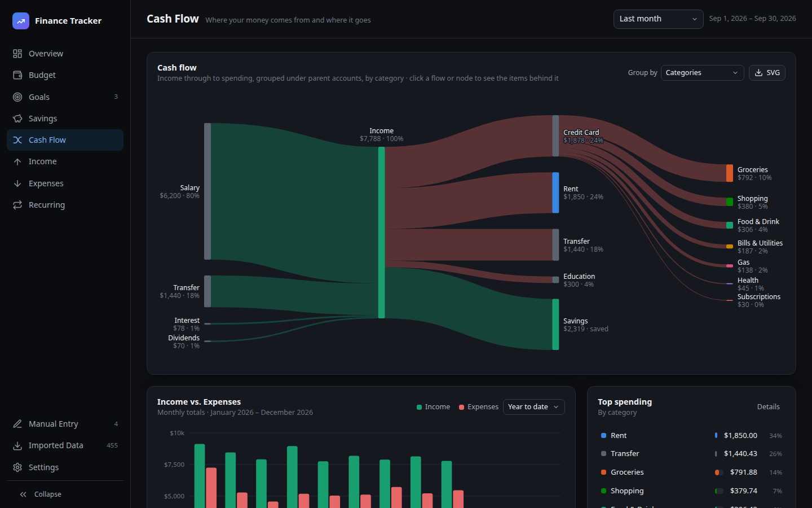

## Features

- **Budget vs. actual** by category, month by month, with a forecast for the months ahead
- **Budgets** that can be monthly, quarterly, yearly, or different for particular months
- **Cash flow diagram** of where your money comes from and where it goes
- **Income and expense breakdowns** by category or vendor, over any date range
- **Recurring charges** found automatically, including price increases on your subscriptions and bills
- **Savings goals** with how much to put away each month to hit each target date
- **Savings over time**: your cash on hand, past and projected
- **Import templates** that learn how to read each bank's CSV files, so future imports take one click
- **Manual entries** for income or expenses that aren't in a statement, once or on a schedule

## How it works

**Use it online or offline.** Open the [live version](https://jordan-bring-gold.github.io/FinanceTracker/), or
download [`index.html`](index.html) (click **Download raw file** on that page) and open it in your browser. The app is
that one file, with no external libraries, so the downloaded copy works 100% offline.

**Your data stays in a folder on your computer.** The first time you open the app, you pick a folder for it. Your
statement files, budget, rules, goals and settings are all saved there, with automatic backups:

```
Finances/                       ← the folder you pick
├── Statements/
│   ├── checking/               ← one folder per bank or card, holding its CSV exports
│   └── credit_card/
├── finance-tracker.json        ← everything else: transactions, budget, rules, goals, settings
└── .finance-tracker-backups/   ← the last 20 versions of finance-tracker.json
```

The one exception: your browser remembers *which* folder you picked, so you don't have to find it again each time.
On later visits you just click once to allow access again. The browser keeps nothing else: no transactions, no
settings, not even a copy of your data.

**No bank connections.** The app never links to your bank, credit card or any other provider. There's no account to
create and no password to share. You download your statements yourself and the app reads them from your folder. It
can't send anything anywhere: it's blocked from making any network connections at all.

**Browser support:** Chrome, Edge or Opera on a computer. Brave works after one setting change (the app shows you
how). Firefox, Safari and phone browsers can't open folders from a web page, so they aren't supported.

## Getting started

Expect the first setup to take about **10–15 minutes**:

1. **Download your transactions.** In each bank's and credit card's website, export your transactions as CSV files.
   A year of history gives the forecasts and recurring-charge detection the most to work with.
2. **Import them.** Open the app, pick your folder, then go to **Imported Data → Import**. Make a folder for each bank
   or card and add its files.
3. **Create a template for each bank or card.** A template tells the app how to read that provider's files: which
   column is the date, the amount and the description. It also holds rules that turn messy descriptions like
   `COSTCO WHSE #0456 SEATTLE WA` into a clean vendor ("Costco") and category ("Groceries").

After that, updating is quick: download your latest statements, drop them into the same folders, and click
**Refresh**. Your templates import everything automatically.

## A tour of the app

*The screenshots use made-up sample data.*

### Overview

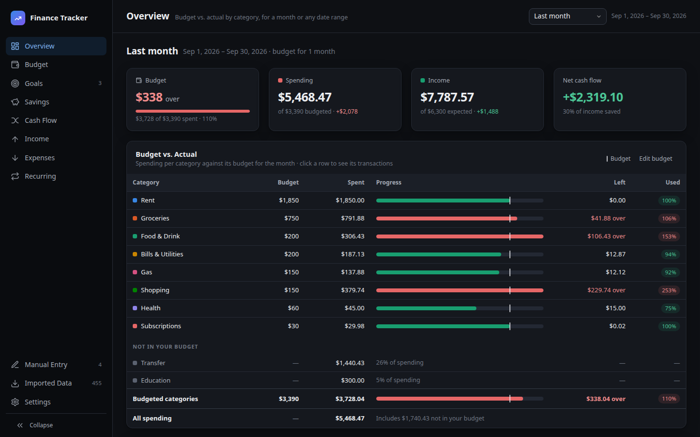

- What you spent against your budget, category by category, for any month
- Totals for spending, income and net cash flow
- Pace markers, so a bill paid on the 1st doesn't look like overspending
- Future months shown as a forecast

### Budget

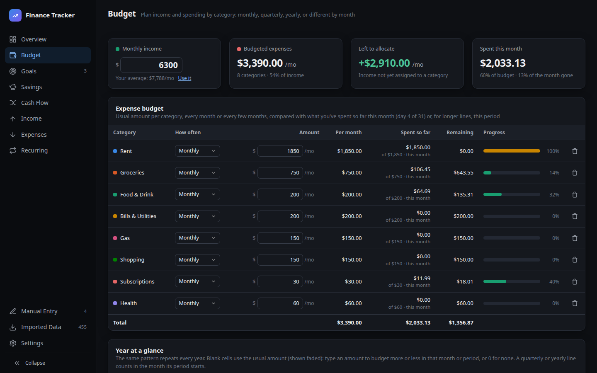

- Your monthly income and an amount for each expense category
- Lines that repeat monthly, quarterly, yearly or every few months
- A year-at-a-glance grid for months that differ, like more for groceries in December
- How much is left to allocate, and how much you've spent so far this month

### Goals

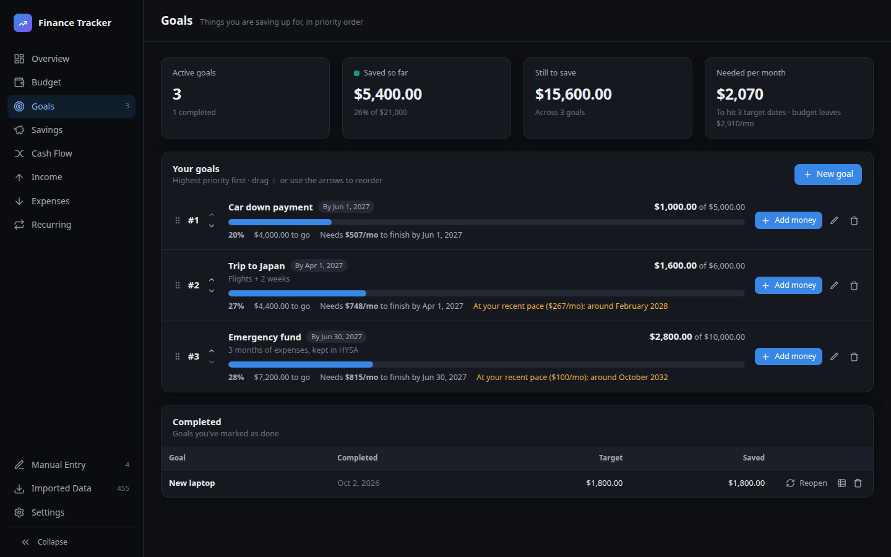

- Things you're saving for, in priority order
- How much you need each month to reach each target date
- When you'll get there at your current pace
- Deposits and withdrawals logged per goal

### Savings

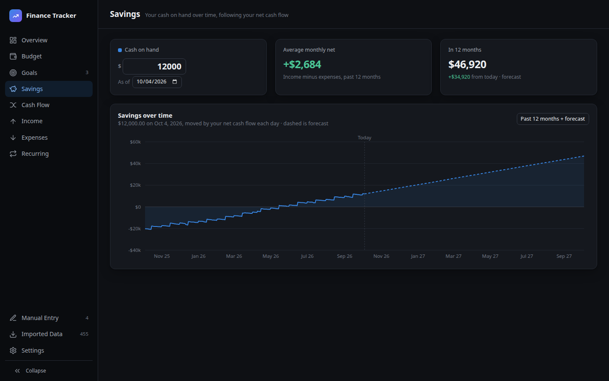

- Your cash on hand over time, from what you have today and your cash flow
- A dashed projection for the next 12 months, based on your budget

### Cash Flow


- A diagram of money flowing from income to accounts to categories
- Click any flow to see the transactions behind it
- Monthly income vs. expenses, and your top spending categories

### Income

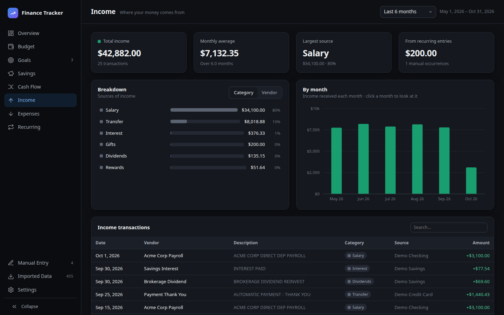

- Where your money comes from, by category or vendor
- Income by month, plus every income transaction

### Expenses

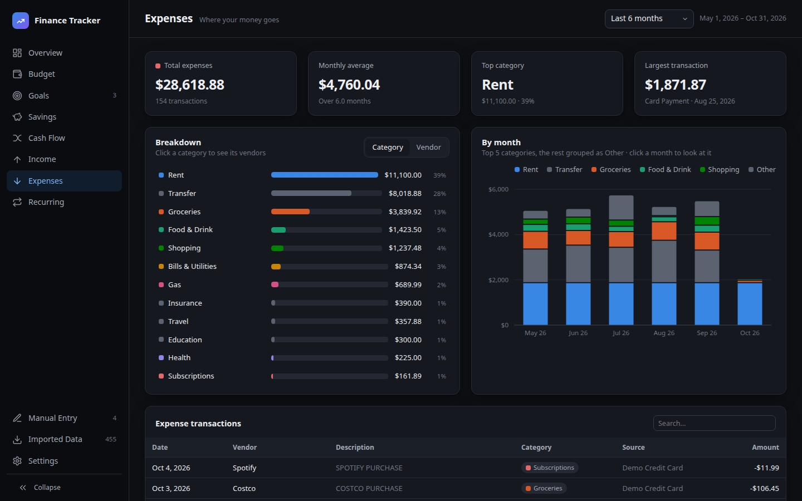

- Where your money goes, by category or vendor
- Spending by month, split by your top categories
- Every expense transaction, with search

### Recurring

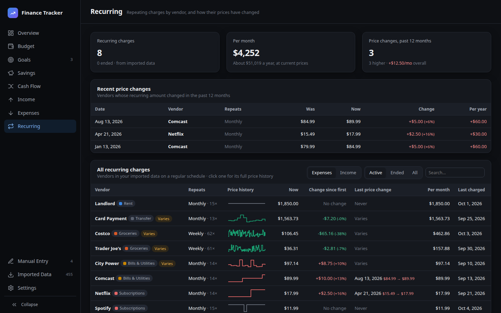

- Subscriptions and bills found automatically in your history
- Price changes, like a streaming service going up $2.50 a month
- A price history for each vendor

### Manual Entry

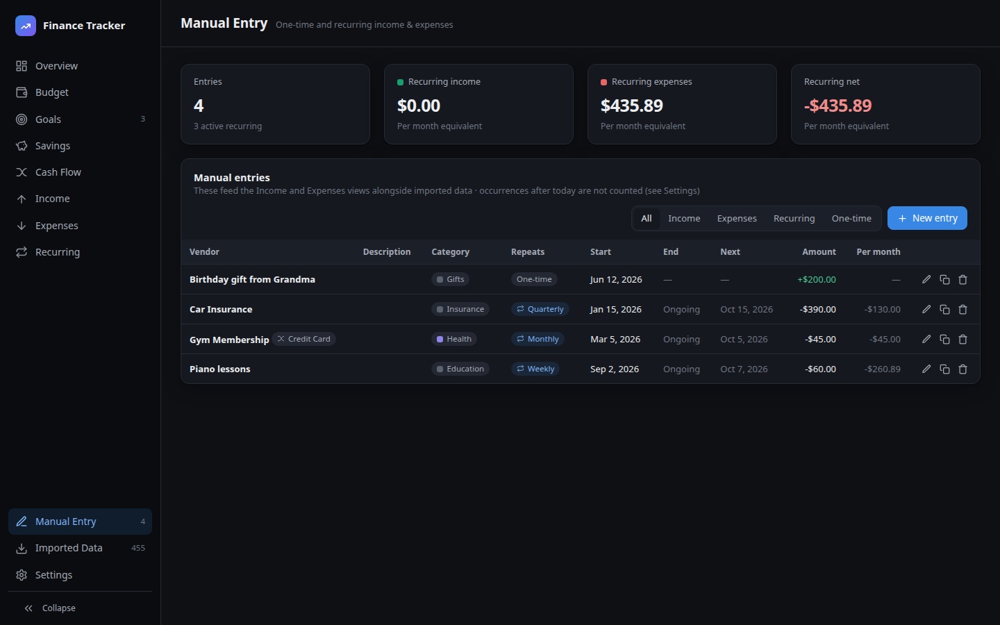

- Income or expenses that aren't in any statement, such as cash or a gift
- One-time, or repeating daily, weekly, monthly, quarterly or yearly

### Imported Data

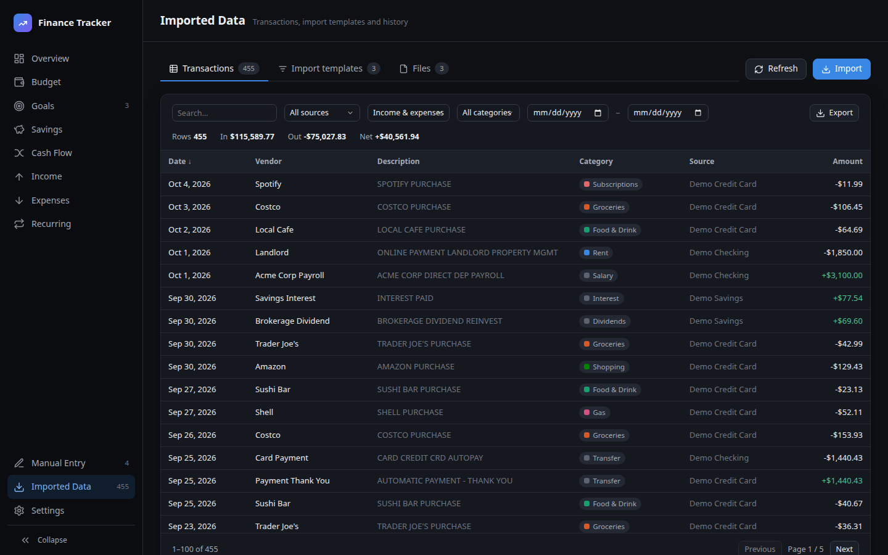

- Every imported transaction, searchable and filterable, with CSV export
- Import new files, or **Refresh** to pick up new and changed ones
- A **Files** tab showing what was imported from each file

**Import templates** tell the app how to read each provider's files:

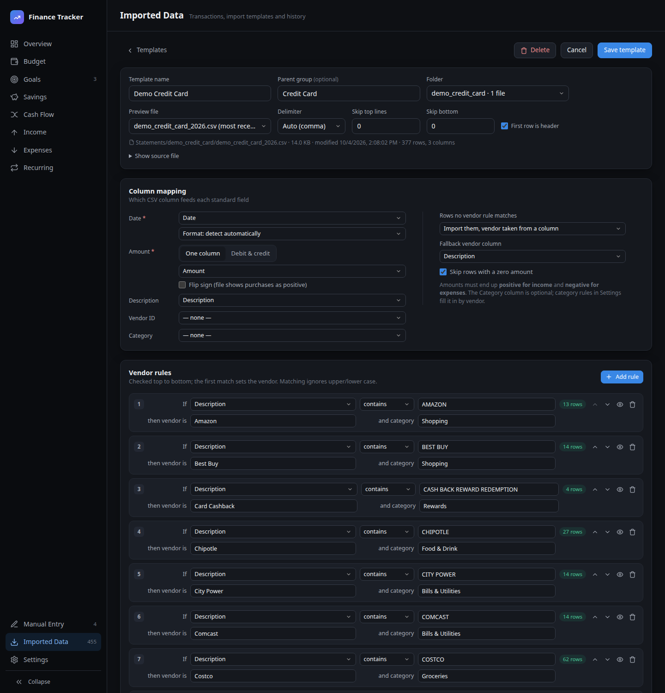

- Map the date, amount and description columns once per bank or card
- Vendor rules: "if the description contains COSTCO, the vendor is Costco and the category is Groceries"
- A live preview of matched and unmatched rows while you edit
- Skip rules for rows you never want, like transfers between your own accounts

### Settings

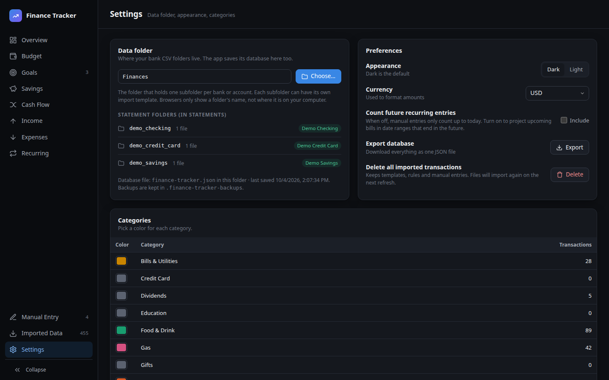

- Your data folder, and the statement folders found in it
- Dark or light theme, and your currency
- A color for each category
- Export everything as one file
